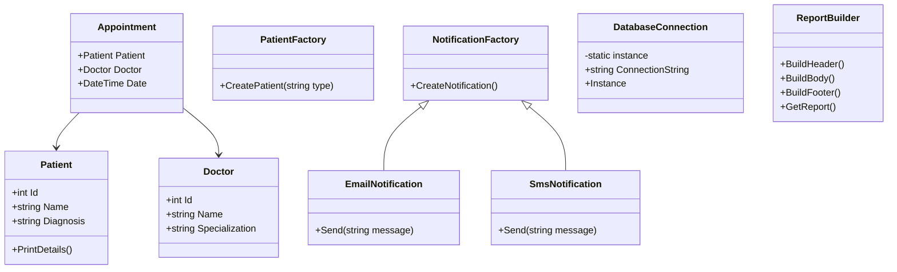

# 🏥 Hospital Management System (C#)


---

## 📘 Overview

This is a modular **Hospital Management System** developed in C# for academic purposes. It demonstrates practical use of all **six creational design patterns** in healthcare scenarios such as patient registration, staff assignment, report generation, and prescription cloning. The architecture follows object-oriented principles and is easily extensible for additional features.

---

## 🧱 Project Architecture

```
HospitalManagementSystem/
│
├── HospitalLib/               → Core classes & pattern implementations
├── HospitalTests/             → NUnit-based test suite
├── HospitalRunner/            → Console demo app (entry point)
├── README.md                  → Documentation
├── CHANGELOG.md               → Version log
└── HospitalManagementSystem.sln
```

---

## 🧩 Creational Design Patterns Used

| Pattern           | Purpose                                         | Class Examples                    |
|------------------|--------------------------------------------------|----------------------------------|
| **Simple Factory**   | Centralized patient creation                     | `PatientFactory`                 |
| **Factory Method**   | Flexible notification generation                 | `EmailFactory`, `SmsFactory`     |
| **Abstract Factory** | Create related medical staff objects             | `PediatricStaffFactory`          |
| **Builder**          | Construct detailed medical reports               | `DiagnosisReportBuilder`         |
| **Prototype**        | Clone prescriptions to avoid re-initialization   | `AntibioticPrescription`         |
| **Singleton**        | Ensure one shared database connection            | `DatabaseConnection`             |

---

## 🖼️ UML Class Diagram (Mermaid)



---

## 🚀 How to Run

### 1. Clone the Repository

```bash
git clone https://github.com/Nelisiwe1/HospitalManagementSystem.git
cd HospitalManagementSystem
```

### 2. Build the Solution

```bash
dotnet build
```

### 3. Run All Unit Tests

```bash
dotnet test
```

### 4. Run the Console Demo

```bash
dotnet run --project HospitalRunner
```

> This demo simulates checking in a patient using the Simple Factory and prints patient details to the console.

---

## ✅ Features Implemented

- ✔️ Check-in Patient Using Medical ID (US-003)
- ✔️ Access Patient Medical Records (US-002)
- ✔️ Assign Doctor and Schedule Appointment
- ✔️ Generate Complex Medical Reports
- ✔️ Clone Prescriptions via Prototype Pattern
- ✔️ Maintain Single Database Connection (Singleton)

---

## 🧪 Testing

- Uses **NUnit** for unit testing
- Tests cover:
  - Simple Factory object creation
  - Factory Method and Abstract Factory outputs
  - Builder report structure
  - Prototype cloning accuracy
  - Singleton consistency

---

## 📂 Project Status

| Feature                         | Status   |
|----------------------------------|----------|
| Creational Patterns             | ✅ Complete |
| Unit Testing                    | ✅ Covered |
| Console Demonstration           | ✅ Working |
| GitHub Issues                   | ✅ Tracked & Closed |
| Documentation                   | ✅ Done |

---

---

## 🧪 Running Tests Locally

To run all unit tests locally:

```bash
dotnet test


## 🧾 License

This project is licensed under the MIT License.  
© 2025 [Nelisiwe](https://github.com/Nelisiwe1)


